<p align="center">
  
</p>

<p align="center">
  
</p>

<p align="center">
  <a href="https://www.linkedin.com/in/gustavorafael09"></a>
  
  
</p>

---

## 👨‍💻 Sobre mim

```python
class Gustavo:
    cargo      = "Analista de Migração & Dados @ Omnismart"
    formacao   = ["Ciência da Computação — Anhembi Morumbi",
                  "Pós em Big Data & Inteligência Analítica — PUCPR (cursando)"]
    trajetoria = ["Suporte N1", "Suporte N2", "Migração & Dados", "Engenharia de Dados 🎯"]
    foco       = ["Pipelines ELT", "Modelagem dimensional", "Qualidade de dados", "Dashboards"]
```

## 💼 O que faço hoje

<table>
<tr>
<td width="50%" valign="top">

**🔄 Migração de plataforma**
- Conduzo a migração de clientes do **PABX legado** para a nova plataforma, do levantamento de requisitos até a virada de chave
- Configuro ambientes **VoIP**: ramais, filas, URAs, troncos, DIDs, rotas, chatbots e pesquisas de satisfação
- Comparo componentes migrados com os existentes no ambiente antigo e **elimino configurações obsoletas**

</td>
<td width="50%" valign="top">

**📊 Dados aplicados à operação**
- Construí um **sistema interno de controle de migrações** com **PostgreSQL, Python e Streamlit**, com rastreio de etapas, métricas de qualidade e análise de gargalos por responsável
- Criei **dashboards em Power BI** que transformam o controle operacional em **indicadores estratégicos**

</td>
</tr>
</table>

---

## 🛠️ Stack

<p align="center">
  
</p>

<p align="center">
  
  
  
  
  
  
  
  
</p>

---

## 🚀 Projetos em destaque

<table>
<tr>
<td width="50%" valign="top">

### 🏦 [bcb-indicadores-pipeline](https://github.com/Gusouzd/bcb-indicadores-pipeline)

Pipeline **automatizado** que coleta diariamente **SELIC, IPCA e câmbio (USD)** da API SGS do Banco Central.

```
API BCB ─▶ Python ─▶ BigQuery ─▶ dbt ─▶ Star schema
            ⏰ GitHub Actions · dias úteis às 6h
```

✅ Carga **idempotente** (MERGE incremental)<br>
✅ Modelagem dimensional (fato + dimensões)<br>
✅ **19 testes** de qualidade com dbt


</td>
<td width="50%" valign="top">

### 🛒 [olist-payments-analytics](https://github.com/Gusouzd/olist-payments-analytics)

ELT sobre **~100 mil pedidos** do e-commerce brasileiro, com análise de **meios de pagamento, vouchers e parcelamento**.

```
Kaggle ─▶ Python ─▶ BigQuery ─▶ dbt
          staging → intermediate → marts
```

💳 Crédito: **mais de 70%** do valor transacionado<br>
📈 Ticket médio de **R$ 163** em **3,5 parcelas**<br>
✅ **26 testes** passando e DAG documentado


</td>
</tr>
</table>

---

## 🐍 Contribuições

<p align="center">
  <picture>
    <source media="(prefers-color-scheme: dark)" srcset="https://raw.githubusercontent.com/Gusouzd/Gusouzd/output/snake-dark.svg" />
    <source media="(prefers-color-scheme: light)" srcset="https://raw.githubusercontent.com/Gusouzd/Gusouzd/output/snake-light.svg" />
    
  </picture>
</p>

<p align="center">
  
</p>
